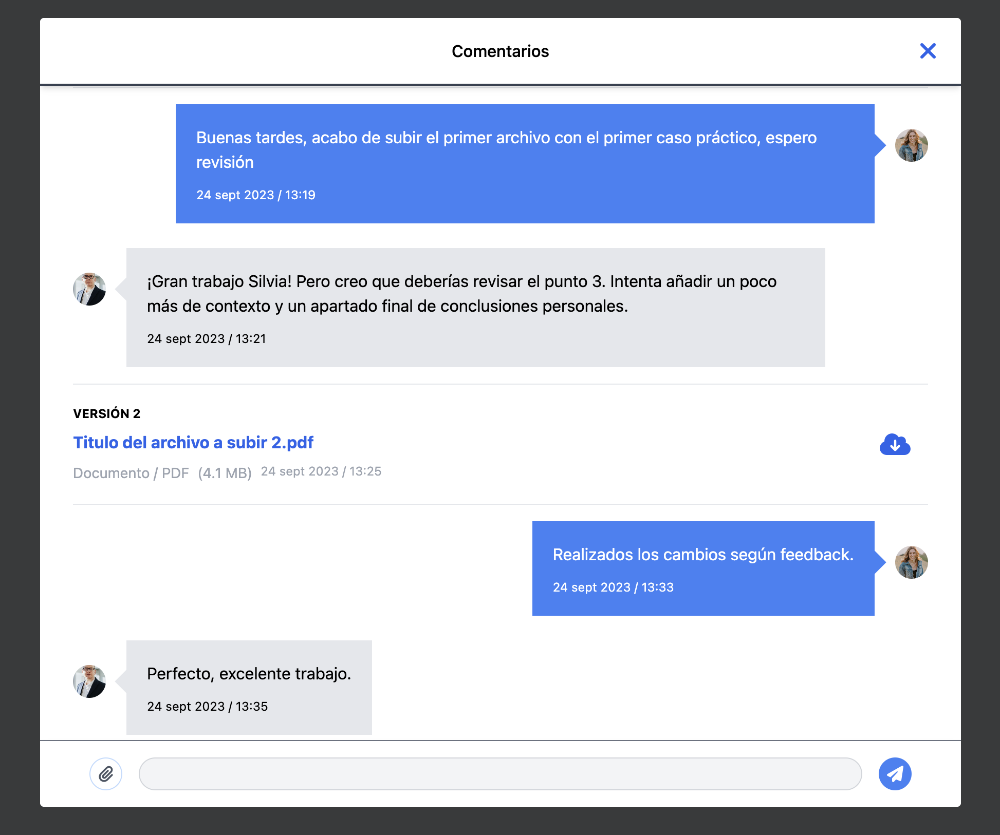

# Demo Modal Chat con Vue 3 + Vite + TypeScript + Cypress + Tailwind CSS
It's a demonstration in which a user engages in a conversation with their tutor.

The project uses Vue 3 `<script setup>` SFCs, check out the [script setup docs](https://v3.vuejs.org/api/sfc-script-setup.html#sfc-script-setup) to learn more.

## Docs 📄
- [Vue 3](https://vuejs.org/guide/introduction.html)
- [Vite](https://vitejs.dev/guide/)
- [Pinia](https://pinia.vuejs.org/getting-started.html)
- [Tailwind CSS](https://v2.tailwindcss.com/docs/installation)
- [Cypress](https://docs.cypress.io/guides/getting-started/installing-cypress)

## Install 💾
Clone the repository https://github.com/simonemandola/demo-chat-modal.git and install dependencies:
```bash
npm install
```

## Run Development Server 🏃‍♂️ 
Run the command below:
```bash
npm run dev
```

And open: [http://localhost:5173/](http://localhost:5173/)

## Build 🏗️
Run the command below:
```bash
npm run build
```
Publish directory: **/dist**

## E2E Test 🧐
All test scripts are in '**cypress**' folder, inside you can create how many folders you need, they will be automatically scanned from Cypress.

To run the test, ensure that the dev server is running and then run:
```bash
npm run cypress:open
```
Automatically will be open the Cypress CLI, then choose the test you want to run.

## Features 📦
- Vue 3 (Composition API) whit `script setup`
- Vite
- TypeScript
- Pinia 🍍
- Tailwind CSS
- Cypress

## Mockups 📸
### Screenshot

### Typing message

### Message sent

### Upload document

### Document sent

